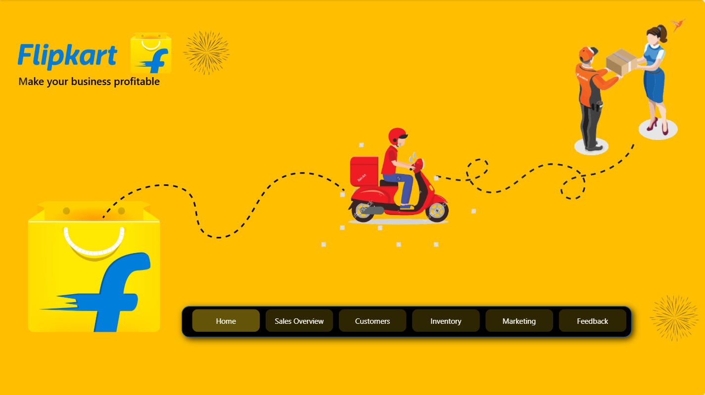
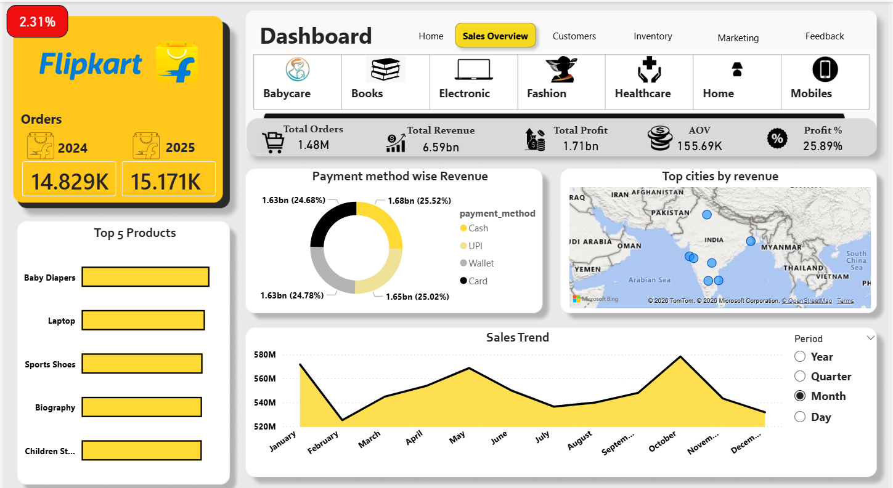
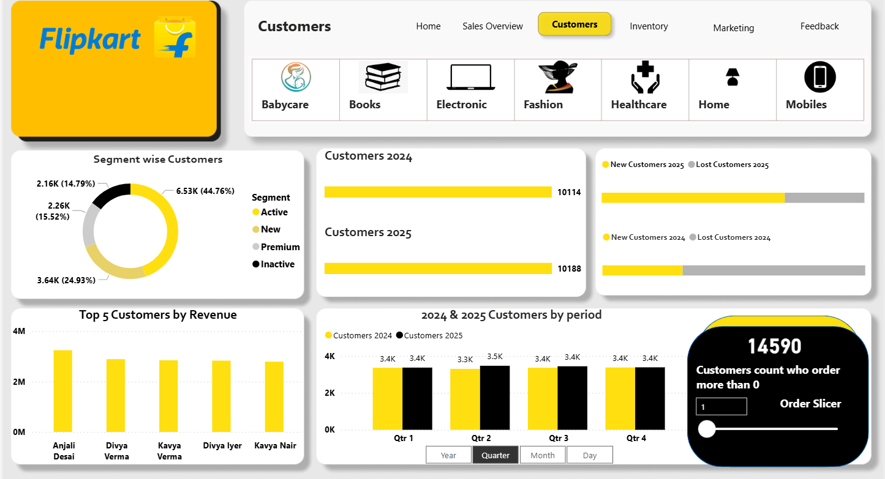
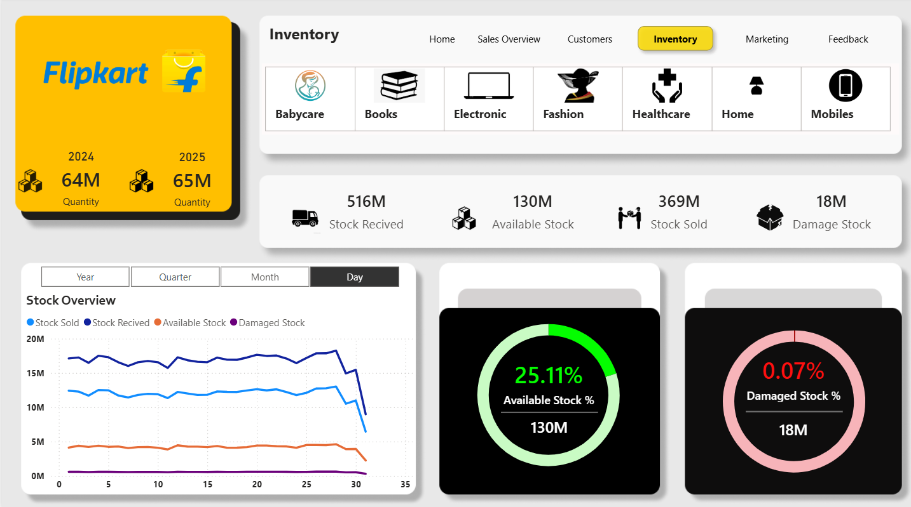
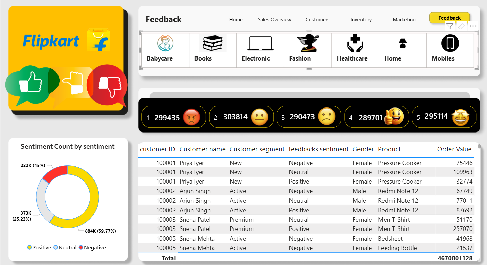

# Flipkart Business Analysis Project 📊

## 🔍 Project Overview
This project presents a complete **Flipkart Business Analysis Dashboard** designed to analyze overall business performance using data-driven insights.  
The dashboard focuses on **sales, profit, categories, customers, regions, and time-based trends** to help stakeholders make informed business decisions.

---

## 🎯 Business Objectives
- Understand overall Flipkart business performance
- Analyze sales and profit trends
- Identify top & low performing categories and products
- Evaluate regional and customer contribution
- Support strategic business decisions using data insights

---

## 🛠 Tools & Technologies Used
- **Power BI** – Dashboard creation & data visualization  

---

## 📊 Dashboard Pages & Analysis

### 1️⃣ Business Overview Dashboard
- High-level KPIs:
  - Total Sales  
  - Total Profit  
  - Total Orders  
  - Profit Margin  
- Quick snapshot of overall business health
- Helps management understand performance at a glance
### 🏠 Home Page

### 2️⃣ Sales Overview
Tracks total revenue, profit, orders, sales trends, and top products/categories.
--Key Insights:
•Sales are highest during festive months (Oct–Nov).
•Electronics and Fashion generate the most revenue.
•Some high-selling products have low profit margins, showing scope for pricing and cost optimization.
### 📈 Sales Overview

### 3️⃣ Customer Analysis
Analyzes new vs returning customers, locations, and purchase behavior.
--Key Insights:
•Returning customers contribute most of the revenue.
•Orders are mainly from metro cities; tier-2 and tier-3 cities show growth potential.
•A small group of customers makes frequent high-value purchases.
### 👥 Customers

### 4️⃣ Inventory Management
Monitors stock availability, stock sold, damaged stock, and product movement.
--Key Insights:
•Fast-moving products often go out of stock, causing missed sales.
•Slow-moving products block capital in inventory.
•Damaged stock is low in quantity but creates regular losses.
### 📦 Inventory

### 5️⃣ Marketing Performance
Evaluates campaign performance, conversions, and ROI.
--Key Insights:
•ROI varies significantly across campaigns.
•Social media campaigns perform better than email campaigns.
•Some campaigns bring traffic but low actual sales.
### 📣 Marketing

### 6️⃣ Customer Feedback Analysis
Reviews ratings, complaints, and satisfaction trends.
--Key Insights:
•Late delivery and damaged products are the main reasons for low ratings.
•Fast delivery and good packaging lead to positive feedback.
•Electronics category receives comparatively more complaints.
### ⭐ Feedback

---

## 📈 Key Business Insights
- A limited number of categories contribute to the majority of revenue  
- Some products show high sales but low profitability  
- Regional performance varies significantly across markets  
- Time-based analysis reveals seasonal sales trends  
- Customer concentration impacts overall revenue stability  

---

## 📂 Project Files
- `Flipkart_Business_Analysis.pbix` – Power BI Dashboard  
- `flipkart_sales_data.xlsx` – Dataset  
- `Screenshots/` – Dashboard screenshots  

---

## 🚀 Project Outcome
Through this project, I gained hands-on experience in:
- End-to-end business data analysis  
- SQL-based analytical querying  
- Power BI dashboard development  
- Converting raw data into actionable business insights  

---

## 👤 Author
**Prathamesh**  
Aspiring Data Analyst | Power BI | SQL | Excel  

📌 *This project is created for portfolio and learning purposes.*
